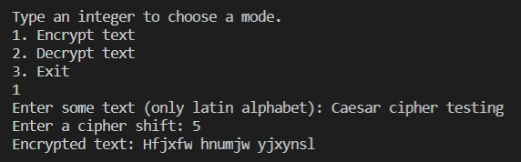

# Caesar Cipher

## :mortar_board: About 
This is my university assignment. The task was to write a program that could encrypt or decrypt text using Caesar Cipher technique. So here it is!

## :computer: Starting
The program is written in pure Python and works in console, so you only need to clone this repository and run the project.
Requirements are:
- Python >= 3.6
- Git
